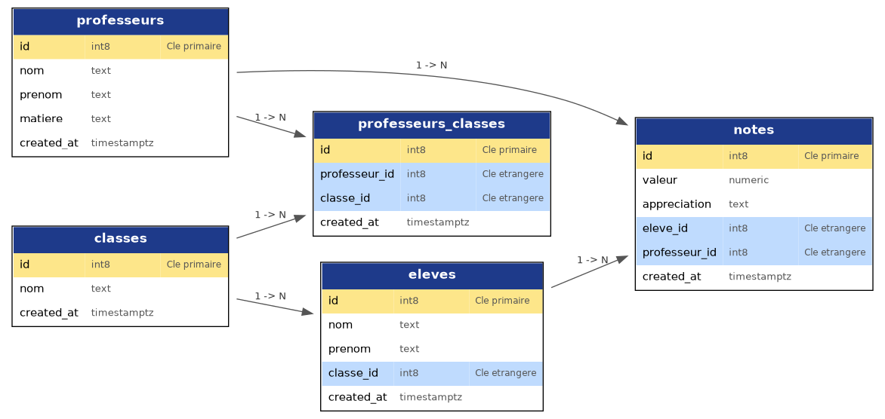

# Alodo Tech — Plateforme de gestion scolaire

Mini-projet full-stack réalisé dans le cadre de l'exercice d'évaluation Alodo Tech.

## Stack technique

- **Front / Back** : Next.js (App Router)
- **Base de données** : Supabase (PostgreSQL, Backend as a Service)
- **Langage** : TypeScript

## Schéma de la base de données



## Installation et lancement du projet

### Prérequis

- [Node.js](https://nodejs.org) (version LTS recommandée)
- Un compte [Supabase](https://supabase.com) avec un projet créé

### 1. Cloner le dépôt

```bash
git clone https://github.com/ton-nom-utilisateur/alodo-tech.git
cd alodo-tech
```

### 2. Installer les dépendances

```bash
npm install
```

### 3. Configurer les variables d'environnement

Créer un fichier `.env.local` à la racine du projet avec le contenu suivant :

```
NEXT_PUBLIC_SUPABASE_URL=url_de_votre_projet_supabase
NEXT_PUBLIC_SUPABASE_ANON_KEY=cle_publishable_de_votre_projet_supabase
```

Ces informations sont disponibles dans votre tableau de bord Supabase, sous **Project Settings > API**.

### 4. Créer les tables dans Supabase

Recréer les 5 tables (`professeurs`, `classes`, `professeurs_classes`, `eleves`, `notes`) via l'éditeur de tables de Supabase, en suivant la structure décrite dans le schéma de base de données (`schema-base-de-donnees.mermaid`).

### 5. Lancer le serveur de développement

```bash
npm run dev
```

L'application est alors accessible sur [http://localhost:3000](http://localhost:3000).

## Pages disponibles

| Route | Description |
|---|---|
| `/professeurs` | Créer et lister les professeurs |
| `/classes` | Créer et lister les classes |
| `/eleves` | Créer et lister les élèves |
| `/assignations` | Assigner un professeur à une classe |
| `/mes-classes` | Parcourir ses classes et ses élèves (vue professeur) |
| `/notes` | Ajouter et consulter les notes d'un élève |

## Auteur

Projet réalisé par Godson dans le cadre de l'exercice d'évaluation Alodo Tech.
